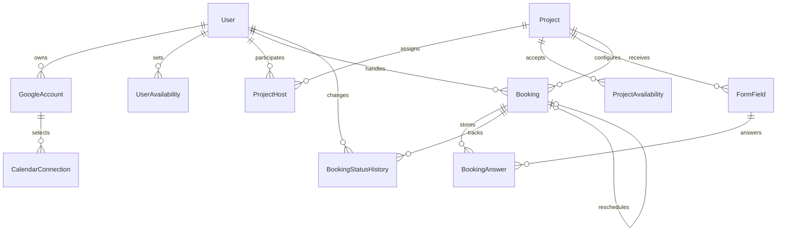

# データモデル詳細設計 v0.1

## 方針

- PostgreSQL を正とし、Prisma は通常のCRUDと migration 管理に使用する。
- 全時刻はDB上では `timestamptz` で保持し、入力・表示・曜日判定は
  `Asia/Tokyo` に固定する。
- 予約者PIIとGoogle OAuthトークンは暗号化値のみDBへ保存する。
- 予約競合の最終防衛線は PostgreSQL の exclusion constraint とする。
- `pg-boss` の管理テーブルはライブラリが所有するため、業務モデルへ含めない。

## ER 図

## 主要判断

### Google アカウント

`GoogleAccount` は Auth.js 標準 `Account` をそのまま使用せず、
`refreshTokenEncrypted` と `accessTokenEncrypted` を保存する。標準の
`PrismaAdapter` を接続すると平文トークン保存になるため、認証永続化を実装する際は
暗号化処理を通す専用の接続処理を用意する。

`CalendarConnection` は空き判定対象として選択されたカレンダーを保持する。
予定を作成するカレンダーは MVP では primary とし、将来切替可能にする。

### 稼働時間

`UserAvailability` と `ProjectAvailability` は曜日を `0`（日曜）から
`6`（土曜）、時刻をJST 0時からの分数として保持する。同一曜日に複数時間帯を
登録できるが、重複時間帯はDB制約で拒否する。

### 予約ステータス

要件の公開ステータスに加え、確定処理中の競合防止用として `HELD`、
外部API作成失敗等の記録用として `FAILED` を内部ステータスに追加する。

予約確定の基本フローは以下とする。

1. 予約候補を計算し、予約者メールは正規化後に HMAC-SHA-256 で検索用ハッシュ化する。
2. `HELD` 予約を短い有効期限付きでINSERTする。このINSERT時に重複制約を評価する。
3. 対象ホストの `FreeBusy` を再確認する。
4. Google Calendar イベントと Meet URL を作成する。
5. 同じ予約行を `CONFIRMED` に更新し、イベントIDと Meet URL を保存する。
6. 外部API失敗時は `FAILED` へ更新し、期限切れ `HELD` はジョブで回収する。

### 暗号化と検索

| データ | 保存方式 |
| --- | --- |
| Google refresh/access token | アプリ側で暗号化して保存 |
| 予約者氏名・メール・電話・回答 | アプリ側で暗号化して保存 |
| メール重複検索キー | 正規化メールを秘密鍵付き HMAC-SHA-256 で保存 |
| キャンセル／変更URL用トークン | 生トークンはメールURLのみ、DBには SHA-256 ハッシュを保存 |

通常のメールアドレス SHA-256 は推測攻撃に弱いため、検索用キーにはサーバー管理の
秘密鍵を使用した HMAC を採用する。

## DB 制約

Prisma スキーマに加え、初期 migration SQL で以下を定義する。

| 対象 | 制約 |
| --- | --- |
| 稼働時間 | 曜日が0〜6、開始分 < 終了分、範囲が0〜1440 |
| 稼働時間 | 同一ユーザー／同一プロジェクトの同一曜日の時間帯重複を禁止 |
| ProjectHost | 優先順位が指定される場合は正整数、同一プロジェクト内で順位重複禁止 |
| Project | 面談時間・期間・バッファ・上限が非負／正値 |
| Booking | `startsAt < endsAt`、占有範囲が面談範囲を包含 |
| Booking | `HELD` / `CONFIRMED` の同一ホスト占有時間重複を禁止 |
| Booking | `HELD` / `CONFIRMED` の同一予約者の面談時間重複を全プロジェクト横断で禁止 |
| CalendarConnection | Googleアカウントごとに primary は最大1件 |

ホストあたり／プロジェクトあたりの1日上限は設定値により判定されるため、
予約トランザクション内で件数を確認し、日付単位の advisory lock を取得して競合を防ぐ。

## モデル一覧

| モデル | 用途 |
| --- | --- |
| `User` | 管理者・ホスト、権限、表示設定 |
| `GoogleAccount` | Google OAuth 識別子と暗号化トークン |
| `CalendarConnection` | 空き判定対象カレンダー |
| `Project` | 予約ページと受付条件 |
| `ProjectHost` | プロジェクト担当者、優先順位 |
| `UserAvailability` | ホスト個人の対応可能時間 |
| `ProjectAvailability` | プロジェクトの受付時間 |
| `FormField` | 予約フォーム定義 |
| `Booking` | 予約、アサイン、Google予定、PII暗号文 |
| `BookingAnswer` | カスタム質問の暗号化回答 |
| `BookingStatusHistory` | 実施・キャンセル等の監査履歴 |

## Prisma 運用

- Prisma CLI は `prisma.config.ts` で `.env.local` の `DATABASE_URL` を読む。
- ローカルDBまたは Railway PostgreSQL の接続先が決まったら
  `DATABASE_URL` を設定し、`npx prisma migrate deploy` で初期 migration を適用する。
- `src/generated/prisma` は生成物のためコミットせず、アプリ側で Prisma Client を
  使用し始める段階でビルド工程に `prisma generate` を追加する。

## Phase 1 以降へ送る事項

- キャンセル／日程変更、リマインド、no-show 自動遷移はこのモデルで追加実装可能。
- メールテンプレートは Phase 2/3 で `ProjectEmailTemplate` として追加する。
- 分析は `Booking` と履歴から集計し、集計速度が必要になった時点でビューを検討する。
